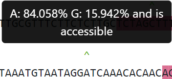

# Inputs and Outputs

This document defines how all values presented to the user are displayed and the inputs that are required to run the software. This document should be updated to match the current present state of the software as the software is updated. 

## Inputs
The program genome_highlighter can take a variety of inputs. Do note that some of these inputs (BED files and VCF files) should only contain the data of one chromosome. This software currently only supports running on one chromosome at a time. These inputs are: 
- Required
    - --seq-file
        - This input is a required argument. This is a FASTA formatted file which contains the genome assembly of the chromosomes for the organism of your choice. This file can contain all chromosomes, and passed indentically for each execution of the software.
    - --peaks
        - This is a required argument. This is a BED file which denotes the desired regions of interest that the software will generate output for. This BED file should only contain the regions of interest for a single chromosome.
    - --output-dir
        - This is a required argument. This is the directory in which all generated files will be placed.  
- Optional 
    - --motif-files
        - This is an optional argument. This argument denotes a list of tuples. These are in the format of "MOTIF_NAME PWM_PATH". Where MOTIF_NAME is the descriptor that will be used in the software to describe the motifs found by running Meme-Suite FIMO with PWM_PATH position weight matrix file on all given regions denoted by --peaks. This flag requires FIMO to be installed and appended to the path prior to running this software with this flag.
    - --variant-data
        - This is an optional argument. This argument denotes the path towards a VCF file denoting variants found within the chromosomes found in the --seq-file. Note that the VCF file ideally should only have the data for one chromosome. The same file may be passed for all chromosomes, however the memory requirements for that are very large and it is recommended to pass different VCF files for each chromosome.  
    - --max-missing-frac
        - This is an optional argument. This argument denotes the maximum missing fraction of samples that are allowed to be missing data for a specific allele. This number ranges from 0 to 1 and is a percentage. I.e. 5% would be --max-missing-frac 0.05.
    - --min-allele-freq
        - This is an optional argument. This argument denotes the minimum allele frequency allowed for a variant to show. This is excludes variants where the minimum of both the reference and alternate allele frequency is less than the number passed to --min-allele-freq. This number ranges from 0 to 1 and is a percentage. I.e. 5% would be --min-allele-freq 0.05.
    - --csv
        - This is an optional argument. This argument produces multiple CSV's when included in the program run. The only current CSV which is verified is the one denoted in the summary.csv section. This flag also produces CSV's for motif_counts, motif_coverage and variant_data. Those sections are not added yet and will be in the future. Do note that currently that this file will contain data for all chromosomes under the directory for one chromosome. This is the leading reason to why one chromosome is only supported currently.
    - --accessibility
        - This is an optional argument. This argument is a FASTA formatted file of the same size as the --seq-file but per each nucleotide position an N is present if the position is not accessible and the nucleotide is present if the position is accessible. This argument adds the accessibility data to the summary.csv. 
    - --site-pi
        - This is an optional argument. This flag tells the software to run VCFTools --site-pi during the program cycle. This flag requires VCFTools to be install and appeneded to the path before using it. 
## summary.csv calculations

A generation of this file may contain the following columns, where JASPAR and STREME relate to position weight matrix files and their descriptors given by the user at runtime. 

- report_file_path
    - The field represents the location of the report file that is represented by the row of data for this field.
- chromosome
    - This field represents the name of the chromosome as given by the BED file (--peaks). This value is set during the construction of the highlights object.
- sequence_start
    - This field represents the 1 index start of the given sequence within a chromosome. This is gathered from the bed file, and is set during the consturction of the highlights object. 
- sequence_stop
    - This field represents the 1 index stop of the given sequence within a chromosome. This is gathered from the bed file, and is set during the consturction of the highlights object. 
- sequence_length
    - This field represents the length of a given chromosome. This value is computed by subtracting the sequence_stop by the sequence_start and adding 1.
- num_variants
    - This field represents the number of variants present in the given sequence region. This value is generated as the dictionary containing the variants is queried and variants are appended onto the html string that is being built.
- num_accessible_variants
    - This field represents the number of variants within a given region that are accessible. Accessibility is defined as not having an N in a given FASTA file which denotes accessiblity. This field is default NaN when no accessibility file is given. This field is incremented during the _append_variant_data function call as each variant is added onto the html string that is being built. Accessibility data is added to each character object, and this object property is simply checked for the current character (variant) during that previously mentioned function call. 
- num_nucleotides_accessible
    - This field is similar to the previous field, except this field denotes the number of nucleotides within that region that are accessible. During the function call add_accessibility, this number is incremented if the present character is not N, denoting the nucleotide as accessible. 
- pi_scores_mean
    - This field is calculated as the mean of pi scores of all variants within a given region for when the number of variants is greater or equal to 2. If the number of variants is 1, then the mean is simply the pi score for that variant. If there are no variants within a given region, the pi_scores_mean is set to NaN. This value is rounded down to 3 decimal places.
- pi_scores_stdev
    - This field is calculated as the standard deviation of all of the pi scores for variants found within a given region if the number of variants is greater or equal to 2. If the number of variants is equal to 1, this value is set to 0. If there are no variants within a given region, then this value is set to NaN. This value is rounded to 3 decimal places. 
- genotype_mean_missing
    - This field describes the mean number of missing alleles for the samples that define the variation within a given region. For example, if there were 3 samples per variant. And the first sample was missing an allele the resulting table would look like this:

    |         | Variant1 | Variant2 | Variant3 |
    | :------ | :------- | :------- | :------- |
    | Sample1 | 1/1      | 1/0      | 1/1      |
    | Sample2 | ./.      | 1/1      | 0/0      |
    | Samle3  | 1/1      | 0/1      | 1/1      |
    | Missing | 1        | 0        | 0        |

    - The mean missing would then be calculated as the average of variant 1 missing 0 samples. Variant 2 missing 1 samples. And variant 3 missing 0 samples. Mathematically this would be (0 + 1 + 0)/3.
- genotype_stdev_missing
    - This field describes the standard deviation of the previous fieldss data.
- num_nucleotides_N
    - This field denotes the number of nucleotides that were not sequenced within the given genome FASTA file. NOTE: This is not the same as the sequence_length - num_nucleotides_accessible.
- num_nucleotides_highlighted
    - This field describes the number of nucleotides which were highlighted in the given region. This denotes the number of nucleotides which were within a given region that were a part of a motif as defined by FIMO and the given position weight matricies. This would be the union between the sets of motifs supplied. 
- JASPAR_unique_motifs
    - This field is a dynamic field based on the motif_descriptor set when running the --motif-files command. This field denotes the number of unique motifs that appear within a given region.
- num_JASPAR_nucleotide_coverage
    - This field is a dynamic field based on the motif_descriptor set when running the --motif-files command and denotes the number of nucleotides that were within, in this case, a jaspar motif. This is calculated by looping over character objects and seeing if their motif dictionary contains the key JASPAR or not.   
- STREME_unique_motifs
    - This field is identical to the JASPAR_unique_motifs field but for the motif descriptor and PWM file which describes STREME motifs.
- num_STREME_nucleotide_coverage
    - This field is identical to the num_JASPAR_nucleotide_coverage field but specific for the motif descriptor STREME.

## HTML File calculations

 - Variants in region
    - This statistic represents the number of variants that are within the given region. This number is incremented during the _append_variant_data function call.
 - Percent of nucleotides with variants
    - This statistic is calculated by taking the total nucleotides and dividing it by the number of variants. This number is rounded to 3 decimal places.
 - Percent of variants that are accessible
    - This statistic is the number of variants that are accessible divided by the total number of variatns. Variants that are accessible are denoted by the character object being set as accessible when importing accessibility data. This row is not printed unless accessibility data is given. This number is rounded to 1 decimal place.
 - Percent of nucleotides that are accessible
    - This statistic is the number of nucleotides that are accessible as defined by the number of nucleotides that do not have an N in their position in the given FASTA accessibility file. This row is not displayed if no accessibility data is given. This number is rounded to 1 decimal place. 
 - Unique JASPAR motifs found
    - This statistic is a variable field which changes based on the given motif_description. In this case, it is JASPAR. This field would denote how many unique JASPAR motifs were found in the region.  
 - Unique STREME motifs found
    - This statistic is a variable field which changes based on the given motif_description. In this case, it is STREME. This field would denote how many unique STREME motifs were found in the region. 
 - JASPAR Percent Coverage
    - This statistic is a variable field which changes based on the given motif_description. In this case, it is JASPAR. This field would denote the percentage of nucleotides within a JASPAR motif over the total number of nucleotides. This value is rounded to the nearest 1 decimal place. This row is absent when no motifs are requested.
 - STREME Percent Coverage
    - This statistic is a variable field which changes based on the given motif_description. In this case, it is STREME. This field would denote the percentage of nucleotides within a STREME motif over the total number of nucleotides. This value is rounded to the nearest 1 decimal place. This row is absent when no motifs are requested.
 - Motif Appearances Columns   
    - This statistic is a variable field which changes based on the given motif_description. This statistic displays the number of nucleotides (count column) that have the given motif. This column does not appear when no motifs are requested. This column is sorted from greatest count to least count, going from the top to the bottom.

## Allele Frequency Calculation

- Allele Frequencies
    - The first frequency as displayed in the html files is always the reference frequency.

    
    
    - For example, the A allele in this case is the reference allele while the G is the alternate allele. The percentage here are the allele frequency rounded to 3 decimal places.   The allele frequencty is calculated like so: 
    1. Gather the samples as tuples of (allele_val_1, allele_val_2)
        - > cleaned_samples = [tuple(variant.split(':', 1)[0].split('/', 1)) for variant in variant_Row[9:]]
    2. Sum the values for the allele value 1 and 2 for each sample (i.e. the allele value for each of its 2 chromosomes). 
    3. Make sure the number of valid allele values is the same for each of these. These should be the same. A missing value here denotes an erronous case like 1/. or ./0 appearing. Log a warning if they are not, and in this case take the minimum of the two to be the number of valid samples.
    4. Take the sum of these summations and then divide that by the total number of samples (2*the number of valid samples). An invalid sample is one who was unable to get a reading and appears as "./.". This value will give the alternate allele percentage, and 1-alt_percent will give the reference allele percentage.
        - > alt_percent = (sample_read_1 + sample_read_2)/(2*valid_individual_count)
        - > ref_percent = 1-alt_percent
    - Definition of allele frequency from [VCF Tools](https://vcftools.github.io/man_latest.html#SITE%20FILTERING%20OPTIONS) in the documentation for the --max-non-ref-ac-any flag
    - VCF file terms used from [sam tools VCF Specification](https://samtools.github.io/hts-specs/VCFv4.3.pdf) version 4.3.

