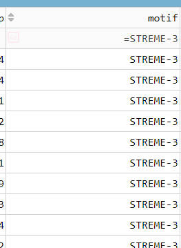
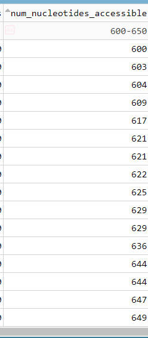
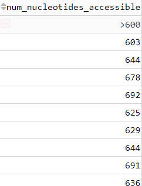
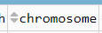
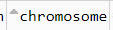
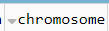
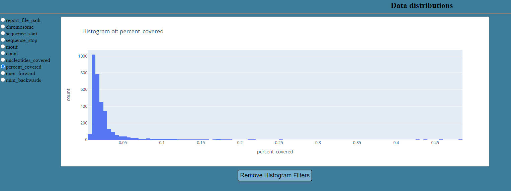
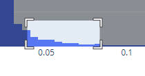

Included with [genome_highlighter](https://github.com/nowling-lab/enhancer-dissection) is a dashboard made with [dash](https://plotly.com/). This dashboard works with both windows and linux, instead of just linux like [genome_highlighter](https://github.com/nowling-lab/enhancer-dissection).

This dashboard allows for the easy sorting, filtering and viewing of the data generated by [genome_highlighter](https://github.com/nowling-lab/enhancer-dissection) when the --csv flag is used. To run this dashboard, simply cd into the visualizer directory and use this python command:

	$ py app.py 

with either of these arguments:

	--data DATA: The folder that genome_highlighter created when ran
	--del: Deletes the html files in the assets folder before copying new html files to it

Where the --data flag should be the path to the outputted directory as given by [genome_highlighter](https://github.com/nowling-lab/enhancer-dissection). To serve the reports, the dashboard must copy the files localy into the visualier directory. Use the --del flag to clean out the folder that the files get copied to. This is useful when trying to visualize various runs of [genome_highlighter](https://github.com/nowling-lab/enhancer-dissection). 

An example run of this program with both arguments might look like this:

	$ py app.py --data C:/genome_highlighter_output_directory/ --del

The currently supported functionality allows for a variety of filtering:

	$  ge or >=
	$  le or <=
	$  lt or <
	$  gt or >
	$  ne or !=
	$  eq or =
	$ - (between, inclusive on both ends)

for numeric columns. Additionally, for string columns, simply typing in them will allow for filtering based on if the string is in any of the columns entries. There as an optional ignore case button included as well. 

Some examples of this type of filtering are like so:

The datatable also supports sorting by ascending or descending:

Lastly there are histograms provided to allow for easily selecting outliers and viewing the distributions of various columns.

Clicking on any of those columns will filter the table based on the column.
Because bucket size sometimes is very narrow, clicking and dragging will zoom in the table to allow ease of access:

Double click on the chart to reset the zoom of the chart.

See [dash](https://plotly.com/) for more information about the table and the charts. They are mostly stock, with some custom interactive additions like the click to filiter.
